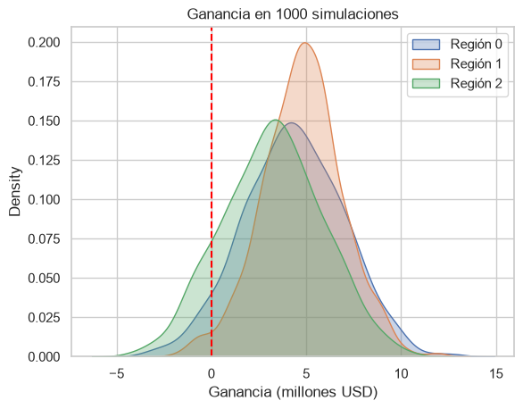

**English** | [Español](README.es.md)

# OilyGiant - Choosing a Region for New Oil Wells

Project to decide which of three regions is the best place to open 200 new oil wells. I used linear regression to predict the reserves and bootstrapping to estimate the profit and the risk of losses.

## Result

| Region | RMSE | Average profit | 95% interval | Risk of loss |
|---|---|---|---|---|
| 0 | 37.7 | 4.32 M USD | -0.81 to 9.41 M | 5.5% |
| **1** | **0.9** | **4.78 M USD** | **0.52 to 8.98 M** | **2.0%** |
| 2 | 40.0 | 3.22 M USD | -1.73 to 8.44 M | 12.3% |

**I recommend region 1**, because it is the only one with a risk of loss below 2.5% and it has the highest average profit. Even though it has lower reserves on average, the model predicts them almost without error, so the wells it picks are really good.



## Business conditions

- In each region 500 points are explored and the best 200 are selected.
- Budget: 100 million USD for the 200 wells.
- Each 1,000 barrels bring 4,500 USD, so a well needs at least 111.1 thousand barrels to break even.
- Regions with a risk of loss of 2.5% or more are discarded.

## Data

Three files in `data/raw/` (`geo_data_0.csv`, `geo_data_1.csv`, `geo_data_2.csv`), one per region, with 100,000 points each:

- `id`: well identifier
- `f0`, `f1`, `f2`: geological features
- `product`: reserves in thousands of barrels

## What I did

1. Checked the data and removed the `id`s that were repeated with different values.
2. Trained one linear regression per region (75% train, 25% validation) and evaluated it with RMSE.
3. Calculated the profit by choosing the 200 wells with the highest predicted reserves.
4. Ran 1,000 bootstrap simulations to get the average profit, the confidence interval and the risk of loss.

**Something I fixed:** in the first version the profit function took only one well instead of the best 200, so every region showed a loss. After fixing it, the conclusion changed.

## Project structure

```
Onlygiant/
├── data/raw/                              # data by region
├── notebooks/
│   └── oilygiant_well_selection.ipynb     # full analysis
├── results/figures/                       # charts
└── requirements.txt
```

## How to run it

```bash
git clone https://github.com/dixonpa/Onlygiant.git
cd Onlygiant
python -m venv .venv
.venv\Scripts\activate        # on Windows
source .venv/bin/activate     # on Mac/Linux
pip install -r requirements.txt
jupyter notebook notebooks/oilygiant_well_selection.ipynb
```

The notebook and charts are in Spanish.

## Tools

Python, pandas, NumPy, scikit-learn, matplotlib, seaborn.

## Author

Paulo Alvarez · [LinkedIn](https://www.linkedin.com/in/paulocealva) · [Portfolio](https://dixonpa.github.io/) · palvarez17@gmail.com
